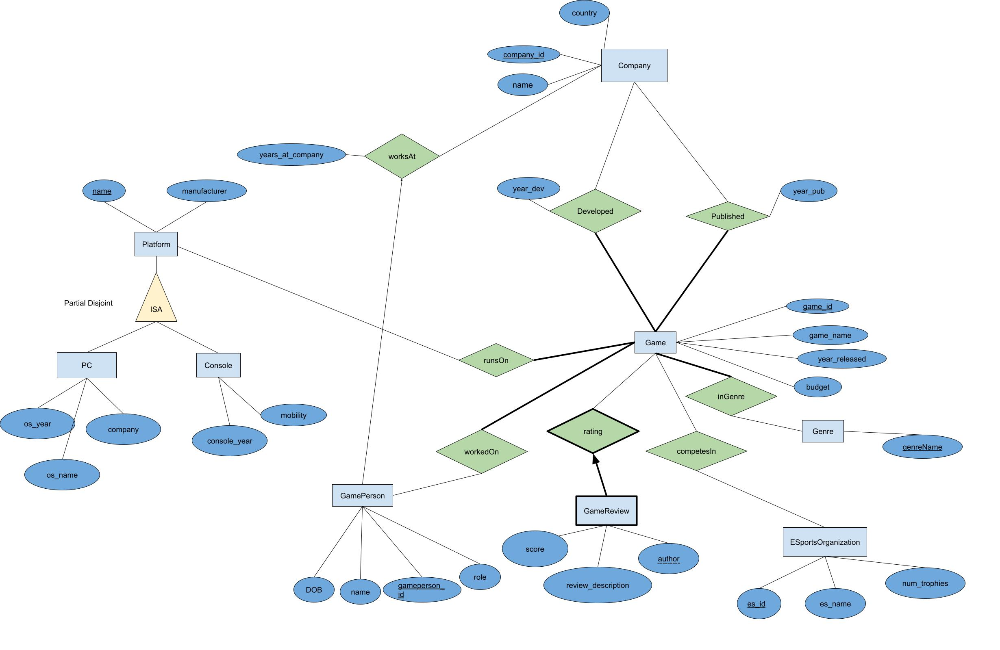

## Summary of the Project

The domain of the project is the video game industry. This application aims to describe the comprehensive database for game enthusiasts, researchers, and industry professionals to easily access and analyze data related to video game development, publishing, people, platforms, and public reception. Users will be able to find information about various games including developer and publisher, genre, platforms the game runs on, and people involved with the games. 

Our focus for users is to allow them to write reviews on games to share their thoughts. Users can find games and write reviews for them, update their reviews, and delete reviews. They can find the average reviews for each game and filter reviews for each game they are interested in.

Tables and attributes will be dynamically loaded from the database, and the user can select tuples based on some settings, or project attributes based on what they want to see. When on the GAME table, users can click on a row to display more information about the game and filter reviews written for the game. Users can insert, update, and delete game reviews. Users can filter the database for games based on genres they are interested in.

Compared to milestone 1 and 2, our database schema has updated the ISA to represent platforms instead of companies. We added the PC entity to the platform ISA. PCs and Consoles are their own entities containing unique information. We also adjusted the relationship between companies and games, with 2 relationships to determine what company or companies developed and published a given game. We added an ESportsOrganization entity to represent E-sports teams, and made clear that GameReview is a weak entity to Game.

## ERD

## Milestone 1
[Milestone 1 PDF](./assets/CPSC304%20Milestone%201%20Group%2014.pdf)

## Milestone 2
[Milestone 2 PDF](./assets/CPSC304_Milestone2_Group14.pdf)

## Milestone 3
[Milestone 3 PDF](./assets/CPSC304_Milestone3_Group14.pdf)

## Milestone 4
[Milestone 4 PDF](./assets/CPSC304_Milestone4_Group14.pdf)
